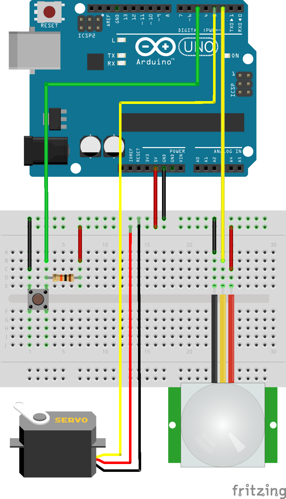

# Fire Breathing Pumpkin!

Wherein we hook up a motion sensor to a servo which is mounted on a hairspray can, stick it in a spooooky pumpkin, put a tealight in front of it, and make **really** sure not to burn anyone.

## Results

Because fire.

Also see [larger version of above image](pumpkin-fire1-small.png), [another example of fire breathing](pumpkin-fire2-small.png), and [a short movie of it](pumpkin-fire-breathing-quick.mov).

## Current Version - Servo Driven

The root of this repo includes the arduino code to move a servo when triggered by a PIR sensor or a button, an STL file of a model that holds a servo and a can of hairspray, and the SCAD file for that model so you can edit dimensions if needed. Specific BOM is below.

The code and model are fairly simple. Code mostly cobbled together from product examples. Holder has the can angled in and friction fit, has 4 holes in the bottom to nail holder into a pumpkin/whatever. I left it up to you to deal with placement of arduino and wiring. And also left it to you to figure out flame/ignition source and placement. I used a tea light, as I didn't have the time to experiment with electronic sparkers/ignition options. A tea light doesn't work all that well, but I'd rather the flame go out (usual failure mode) and this all fail to ignite, rather than it igniting too much/often... As a starting point, I found the best placement of a tea light to be roughly 1.5" below nozzle, and 3" away from nozzle. 

### Bill Of Materials

The 3D printed holder only depends on the dimensions fo the servo and hairspray can. I called out dimensions of both objects in the scad file, so it should be easy enough to change them, but buy the below if you just want to use the included stl file.

| Item              | Description/Comments | Link |
| ----------------- | -------------------- | ---- |
| Hairspray         | Tresemme Hairspray can, 1.5oz travel size | [Target](https://www.target.com/p/tresemme-tres-two-extra-hold-hairspray-travel-size-1-5oz/-/A-13294119) |
| Servo             | Tower Pro SG92R Microservo | [Adafruit](https://www.adafruit.com/product/169) |
| Arduino           | Arduino Uno used, but only three IO pins are used so almost any version should be fine |  |
| PIR Sensor        | Bought long ago from Radioshack, soo... Parallax Passive Infrared (PIR) Sensor, Rev B, SKU 555-28027 | [Parallax](https://www.parallax.com/product/pir-sensor-with-led-signal/) |
| Breadboard        | or any other means of connecting wires |  |
| Button & Resistor | if you want fire on demand w/o waving your hand in front of PIR |  |

## Build

SCAD file included if you want to make any changes, but STL should suit most just fine. How to 3d print in general is out of scope of this readme, but model was designed to print with the common plane of the rectangular servo holder 'back' and 'side' of can holder flat on build plate (YZ Plane in openscad view) and with some supports recommended for underside lip of can holder. Image below shows assembled holder, in the mentioned printing orientation.

Wiring diagram shows set up of various pieces to work with included ino file/arduino code.

## First Version - with Glade Dispenser

I had just enough pieces to hack something together the day of Halloween. And even found a pumpkin spice glade scented can! (For pumpkin scented flaming breath) I also added a button to manually trigger the flame breath, because.

The Glade Air Freshener dispenser worked pretty well, but I wanted more fire, for longer. I've moved all glade dispenser related files to a sub directory. The wiring diagram and code is unfortunately not tested - I'm not sure if the code is the final version, and I recreated the wiring diagram from memory and this code version.

I will hopefully be able to clean up my mess of a first version so you can still do this with easy enough to find and assemble parts (just a Glade Air Freshener, motion sensor, and an arduino - no 3d printer needed).

Also, if you don't want to do any electronics work, you can just connect wires to the Glade dispenser as I did, but then simply run them back to your apt/house and then just touch the bare ends together - viola, remote fire button. You probably don't even need to solder the wires to the button in the Glade dispenser, alligator clips might work?

## Other Versions

The code was originally copied from [Richard Osgood's version from the WayBack Machine](https://web.archive.org/web/20131106091413/http://www.richardosgood.com/blog/wp-content/uploads/2013/10/fireLantern_v1.ino), but I actually ended up not using any as I had a motion sensor, not a distance sensor. Code checked in to maintain a copy of it and to acknowledge the inspiration. A [great Youtube video is available](https://www.youtube.com/watch?v=qDRTbuhs05Q) showing his build process.

I recently saw [Markus Haack's version here](https://github.com/mhaack/halloween-pumpkin-fire) which is quite neat - uses wifi, MQTT, and wood/metal parts instead of 3d printing. I may look at this for remote operation (wifi vs bluetooth), but we'll see if that comes to pass at all.
